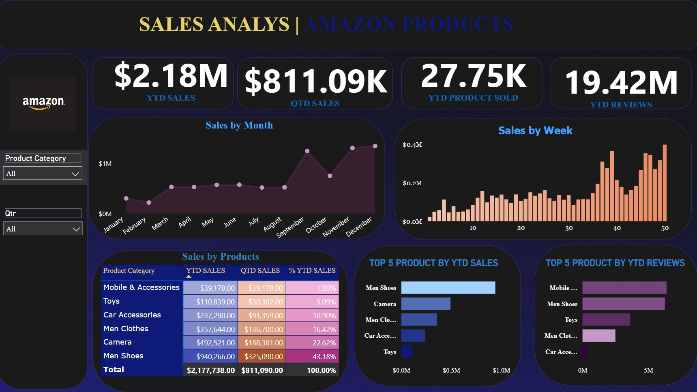
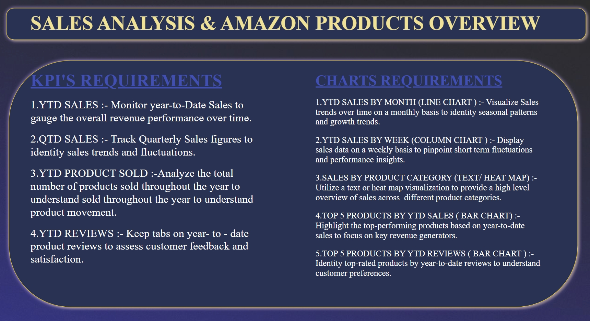

📊 Power BI Amazon Product Sales Dashboard
This project is a comprehensive Power BI report that analyzes sales performance of Amazon products using key KPIs and visuals.
📌 Project Overview
1.YTD Sales: $2.18M
2.QTD Sales: $811.09K
3.YTD Product Sold: 27.75K
4.YTD Reviews: 19.42M

📈 Dashboard Features

1.Line Chart: Monthly Sales Trends
2.Column Chart: Weekly Sales Insights
3.Matrix Table: Sales by Product Category
4.Bar Charts:Top 5 Products by YTD Sales
             Top 5 Products by YTD Reviews

📷 Screenshots
Dashboard View
:https://github.com/Rajugudisela7075/Amazon-Products-and-Sales-analysis/blob/main/Overview.jpeg

KPI & Charts Requirements
:https://github.com/Rajugudisela7075/Amazon-Products-and-Sales-analysis/blob/main/Dashboard.jpeg

📁 Files
Amazon_Sales_Dashboard.pbix`: Power BI file
Dashboard.jpeg: Visual snapshot of the dashboard
Overview.jpeg: KPI and chart requirement snapshot
💡 Insights
 Men’s Shoes is the top-performing product by sales.
Mobile & Accessories has the highest customer review volume.
Sales peak in October and December, indicating seasonal trends.

📌 Tools Used
Power BI Desktop
-Data cleaning
- DAX
- Data Visualization & Analysis
